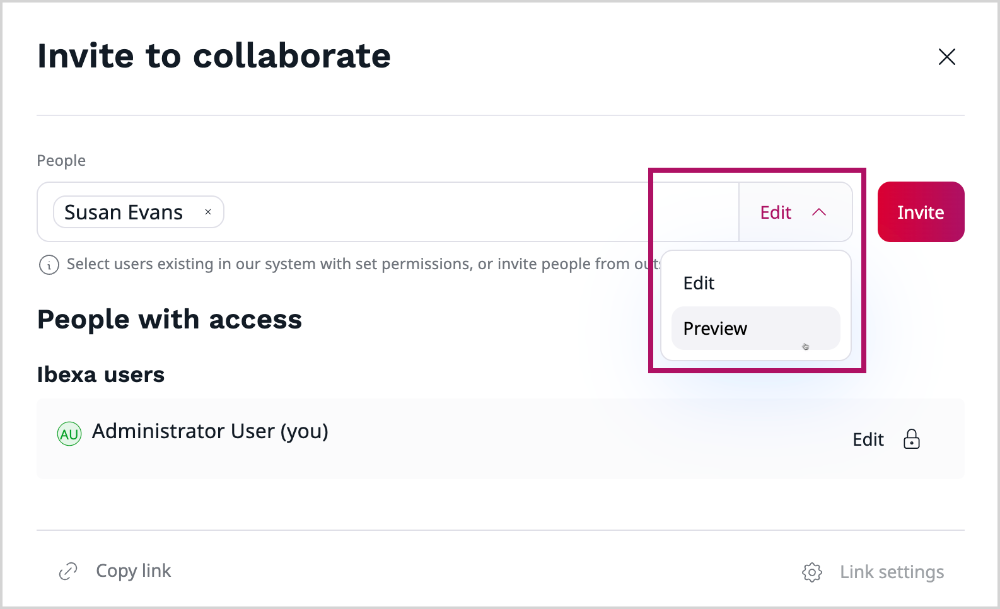

# Collaborative editing product guide

## What is collaborative editing

Collaborative editing is a feature that allows multiple users to work on the same simultaneously - whether to preview, review, or edit it.
By giving users access to preview the content before it's published, review and collaboration become much easier.
An additional option here is the ability to copy a link to the content item, which allows to share it through communication channels.
It improves collaboration with external users, such as third-party agencies.

A more advanced part of the collaboration feature is the Real-time editing.
Users can edit and review content in real time, making teamwork faster, more efficient, and streamlining the content review process.
The system automatically tracks changes, allowing seamless collaboration within a single content item.

## Availability

Collaborative editing is available in all [[= product_name =]] editions.
To use Real-time editing feature, you must make arrangements with [[= product_name_base =]], and accept Terms & Conditions and Service Level Agreement in the Support Portal.

## Prerequisites

To use the **Copy link** option, which allows you to copy a link to the clipboard and share it through communication channels with other users, the Clipboard API is required.
As a result, this option may not work in some browsers, such as Safari.

## How does collaboration work

### Content preview

The basic option provided by the Collaboration feature, is the ability to preview content.
This allows the user to grant preview access to logged-in users, as well as share a public link with external users.

You can share a direct link to the collaborative session using the **Copy link** button.
Link is copied to the clipboard and you can share it with the users through communication channels.

### Collaboration session

Collaborative editing allows to work together on the same content items.
This is done through a collaboration session.

When you create a new draft of a content item you can invite other users to join a collaboration session, thanks to [CKEditor collaboration features](https://ckeditor.com/ckeditor-5/capabilities/collaboration-features/).
This action generates a unique session for that draft.
Collaboration session begins when first invited user accepts the invitation and joins the session.

To start collaborative editing, you need to invite collaborators using the **Share** button.

You can invite other users to join the session, both internal and external:

- **Internal** - by searching their name or email address. These users can either edit the content item or preview it, depending on your choice.
- **External** - by providing their email address in the field. They can only preview the content item.

Once they accept the invitation, they are able to join you in editing content item or reviewing it.

You can change the users access or remove it at any time.

After inviting users to a collaboration session, they receive a notification visible on the main dashboard or by email.

Users can also join a collaboration session using the **Join** button:

- available in new tabs of the **My content** block on the dashboard - *My shared drafts* and *Drafts shared with me*
- by accessing a content draft in the **Drafts** menu

### Real-time editing

Real-time editing is an advanced part of the Collaboration feature.
It works by syncing changes in real time, so everyone can see updates instantly.
Avatars of the users invited to collaboration session are visible at the top of the editing screen, also in distraction free mode.
While editing Rich Text fields, you can see colored tracking tags with user avatar thumbnails that indicate who is currently working on it.

Everyone in the session can see each other's updates as they happen — no more switching between tools or waiting for feedback.
This makes content creation and review faster, more interactive, and much easier to manage as a team.

Users can edit the content only if an administrator gives them the necessary permissions.
These permissions must be set before the user is invited to the session, otherwise the **Edit** access option is unavailable (grayed out).

#### Editing content items

Collaborative editing is enabled in [Rich Text](rich_text.md) fields.
Other fields are disabled and can be only edited by the owner of the content item.

Collaboration is available for the following content types with Rich Text fields:

- Article
- Folder
- Form
- Product category
- Custom content types

All changes made by collaborators are automatically saved when owner publishes or saves content.
Collaborators can leave collaboration session any time without losing data.

## Benefits

### Simplified content review process

With preview access to the content draft, reviewers can jump in, check the content, and approve it more quickly.
This streamlines the entire review cycle and minimizes delays caused by version confusion or slow feedback.
Review can be done even by external users without a need to set up an account in [[= product_name =]].

### Cross-functional collaboration

Collaborative editing allows teams to involve users from across the organization.
Their input can be integrated directly into the editing process, leading to more accurate and aligned content.

### Enhanced teamwork

All the users invited to the collaboration session can share ideas, make suggestions, and refine each other’s work in a shared environment, creating a stronger sense of team ownership and collaboration.

### Real-time collaboration

Collaborative editing enables multiple users to work on the same content item at the same time.
Everyone in the session can see changes as they happen, which shortens the feedback loop and allows multiple people to work in parallel.

### Improved efficiency

By allowing simultaneous editing, the content creation and review process becomes significantly faster.
Team members can work together and finalize content in a fraction of the time it would take with a standard workflow.

### Seamless feedback loop

Users can share and receive feedback instantly within the same editing interface.
This reduces the need to switch between apps or track changes manually.