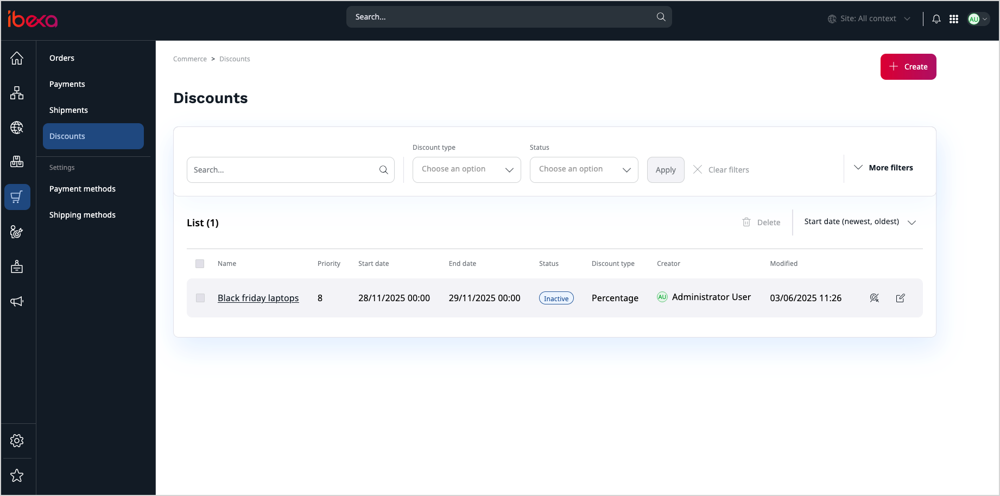

# Discounts product guide

## What are discounts

Just like brick-and-mortar shops, online stores use clever strategies to attract new customers, keep loyal ones, boost sales, highlight special products, and clear out inventory.

One powerful technique that helps achieve these goals is offering discounts.
Discounts allow online stores to temporarily or permanently reduce prices on specific products or categories, making deals more attractive to potential buyers.
They can be used to encourage first-time purchases, reward loyal customers, promote new or slow-moving items, or drive sales during seasonal events.
By displaying discounted prices clearly in the catalog or cart, businesses can create a sense of urgency, increase customer satisfaction, and ultimately boost revenue.

[[= product_name =]] can be equipped with the Discounts [LTS update](editions.md#lts-updates) that introduces a highly extensible solution for building discounts.

Store managers can create general discounts that apply for products from the product catalog or specific discounts that apply for products in the customer's shopping cart.
They can choose how the discount is calculated and set conditions to decide when their discounts are applied.

The conditions used to limit the applicability of a discount include, for example, rules that check whether:

- the product belongs to a specific category
- the customer belongs to a specific customer group
- minimum purchase amount (total cart value) is met
- minimum purchase quantity (per product) is met

!!! note "Difference between discounts and price rules"

    Unlike flexible and highly configurable discounts, [prices applied to customer groups](prices.md#custom-pricing) cannot have time limits, only apply to specific customer groups, and do not offer flexibility to adjust prices at cart level.

## Availability

Discounts are an opt-in capability available as an [LTS update](editions.md#lts-updates) starting with the v4.6.19 version of [[= product_name_com =]].
To begin using Discounts, you must first [install the required packages and perform initial configuration](install_discounts.md).

## How it works

The Discounts feature hooks into the price resolving logic of products, allowing you to modify it before it's displayed to the customers.

### Core concepts

#### Discounts

Discounts are reductions in the price of a product, typically implemented as part of a marketing campaign.

Discounts are applied in two places:

- **Product catalog** - catalog discounts are activated when browsing the product catalog and do not require any action from the customer to be activated
- **Cart** - cart discounts can activate when entering the [cart](cart.md), if the right conditions are met. They may also require entering a discount code to be activated

A shopping cart can have multiple active discounts, but a specific product can only have a single discount applied to it at a time.

#### Discounts priority

When two or more discounts can be applied to a single product, the system evaluates the following properties to choose the right one:

- discount activation place (cart discounts rank higher over catalog discounts)
- discount priority (higher priority ranks higher)
- discount creation date (newer discounts rank higher)

The properties are evaluated in the order given above until a single discount is selected.

#### Discount properties

After choosing where the discount applies (catalog or cart), you can choose the discount type:

- **Fixed amount** - where a specified amount of money, for example, 5 Euro, is deducted from the base price of the product
- **Percentage** - where a specified percentage, for example, 10%, is used to calculate the deducted amount from the product's base price

Discounts are translatable and you can limit them to specific [regions](pim_guide.md#regions) or a single currency.
They can be permanent or be active only in a specified time frame.
Regardless of the specified dates, you can disable a discount at any time to prevent customers from using it.

The discount data is split into two parts:

- name and description add internal information for the store managers
- promotion information add additional information displayed to the customers

#### Target groups

With discounts, you can target your entire customer base or only a subset of it belonging to specified [customer groups](customer_groups.md).

#### Product selection

All products, including [product variants](pim_guide.md#product-variants), can be selected when creating a discount.
You can also limit this choice to a subset of products:

- belonging to selected [product categories](pim_guide.md#product-categories)
- hand-picked manually for special cases

#### Conditions

For **cart discounts**, you can specify additional conditions that must be met for the discount to apply.

These conditions can include:

- minimum purchase quantity (per product)
- minimum purchase amount (total cart value)
- special [discount codes](#discount-codes)

##### Discount codes

For **cart discounts**, you can specify an additional text value that needs to be entered in the cart for the discount to apply.

The discount code usage can be limited per customer:

- single use: every customer can use this code only once
- limited use: every customer can use the code a specified number of times
- unlimited

## Capabilities

### Management

Users with the appropriate permissions, governed by role-based policies, can control the lifecycle of discounts by creating, editing, and deleting them.
Additionally, discount configurations can be enabled or disabled depending on the organization's needs.

An intuitive discounts interface displays a list of all available discounts.
Here, you can search for specific discounts and filter them by type, status, or more.
By accessing the detailed view of individual discounts, you can quickly review all their parameters.

### Extensibility

Built-in discount types offer a good starting point, but the real power of the discounts lies in extensibility.
Extending discounts opens up new possibilities for building promotional campaigns that help move stock and attach customers.

For example, [[= product_name =]] could apply a special discount when a customer places their 1st, 3rd, or 100th order in the storefront.
This encourages first-time purchases and drives long-term customer loyalty.

## Use cases

Out of the box, the [[= product_name_base =]] Discounts LTS update comes with multiple discount types that can be applied in the following use cases.

### End of Season Sale

Create a permanent discount for products manufactured last season to increase attention for them.

### Temporary sales

Create urgency by offering promoted sales that are active only in a specified time frame to attract new customers or increase conversation, for example during events like Black Week or Cyber Monday.

### Reward loyal customers

Make your newsletters readers or chosen customer groups feel special by providing them with a dedicated discount that applies only to them, either by manually selecting a target audience, or by using a discount code.

### Reward large purchases

Encourage larger purchases and increase the average order size by applying an automatic discount when the purchase amount or quantity exceeds specified threshold.
